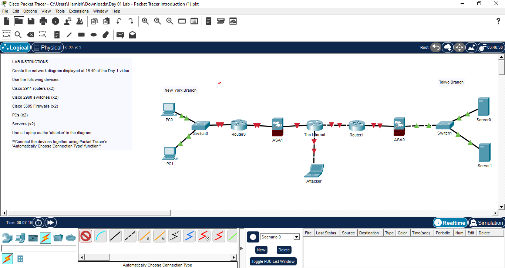

# 📅 Day 01 — Packet Tracer Lab (Network Topology)

## 🎯 Objective

Build a basic enterprise network with:

* Two branch offices (New York & Tokyo)
* Routers, switches, firewalls
* Internet connection
* Attacker simulation

---

## 🧰 Devices Used

* Cisco 2911 Routers (2)
* Cisco 2960 Switches (2)
* Cisco ASA 5505 Firewalls (2)
* PCs (2)
* Servers (2)
* Attacker Laptop (1)

---

## 🌐 Network Topology

---

## ⚙️ What I Learned

* Basic network design
* Connecting devices in Packet Tracer
* Understanding enterprise network structure
* Role of firewalls and routers

---

## 🚀 Skills Demonstrated

* Networking Fundamentals
* Cisco Packet Tracer
* Topology Design

---

## 📂 Files

* `Day01-Lab.pkt` → Packet Tracer file
* `day01-topology.png` → Network diagram

---

## 📌 Author

Balaji — NOC Engineer | Aspiring DevOps Engineer
