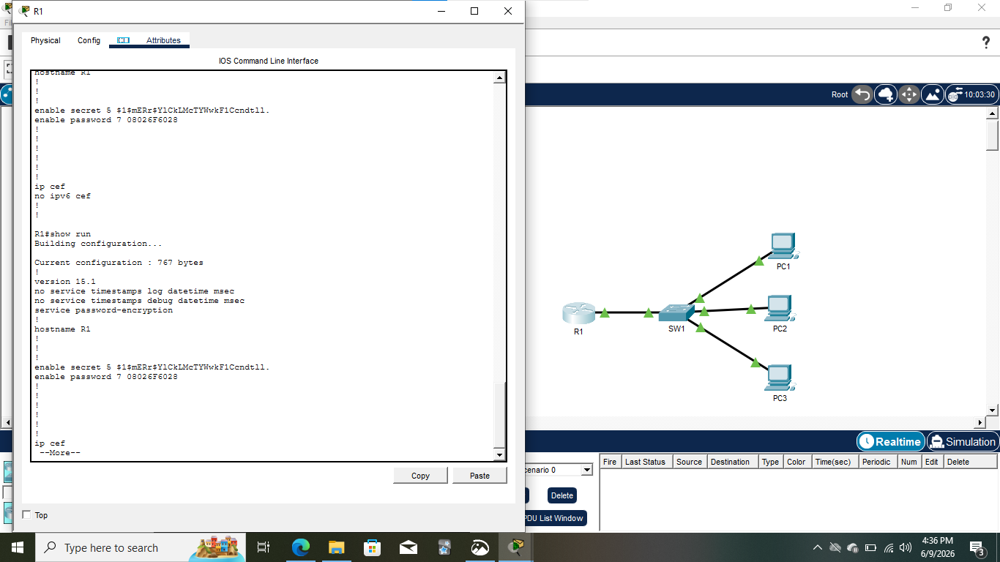

# Day 04 — Device Security: Hostnames & Enable Password Encryption

## 🎯 Lab Overview
This lab focuses on **basic device security hardening** by configuring hostnames, enable passwords, and understanding **password encryption types** on Cisco routers and switches.

The objective is to differentiate between **enable password** and **enable secret**, and verify how Cisco stores encrypted credentials.

---

## 🖥️ Network Topology
- 1 × Cisco Router (R1)  
- 1 × Cisco Switch (SW1)  
- 3 × PCs (PC1, PC2, PC3)

All end devices are connected through a single access switch.

---

## 🧩 Lab Tasks Performed
1. Changed hostnames on router and switch (`R1`, `SW1`).  
2. Configured **unencrypted enable password** (`CCNA`).  
3. Tested password access from user EXEC to privileged EXEC mode.  
4. Viewed passwords in the running configuration.  
5. Enabled **service password-encryption**.  
6. Verified encrypted passwords in running configuration.  
7. Configured **secure enable secret** password (`Cisco`).  
8. Tested login behavior after configuring enable secret.  
9. Identified encryption types used by:
   - enable password  
   - enable secret  
10. Saved running configuration to startup configuration.

---

## 🔐 Password & Encryption Analysis
| Feature | Observation |
|------|-------------|
| enable password | Weak, reversible encryption |
| enable secret | Strong, irreversible encryption |
| Encryption Type (enable password) | Type 7 |
| Encryption Type (enable secret) | Type 5 |
| Recommended Practice | Always use enable secret |

---

## 🖼️ Topology Screenshot

---

## 📂 Files
- `Day 04 Lab – Device Security.pkt`  
- `Screenshot.png`

📥 Download the Packet Tracer file to view device configurations and verification steps.

---

## 💡 Key Learnings
- Learned the difference between **enable password** and **enable secret**.  
- Understood Cisco password encryption types (Type 7 vs Type 5).  
- Practiced basic device hardening steps.  
- Improved confidence with IOS security fundamentals.

---

📌 **Progress:** Day 04 of 60 — Strengthening Cisco device security foundations 🔐🚀
